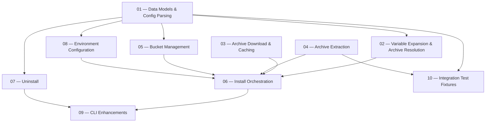

# Poks Implementation Stories

This directory contains the stories derived from the [specification](../specs.md). Each story is self-contained and can be implemented independently unless explicitly noted as having a dependency.

## Dependency Graph

## Parallelism

Stories **01**, **03**, and **04** have no inter-dependencies and can start immediately.
Once **01** is done, stories **02**, **05**, **07**, **08**, and **10** can proceed in parallel.
Story **06** integrates everything and depends on 02–05 and 08.
Story **09** polishes the CLI and depends on 06 and 07.
Story **10** provides integration test fixtures used by the integration tests in Story 06 and beyond.

## Story List

| # | Story | Dependencies | Est. Size |
|---|-------|-------------|-----------|
| 01 | [Data Models & Config Parsing](01_data_models.md) | — | M |
| 02 | [Variable Expansion & Archive Resolution](02_variable_expansion.md) | 01 | S |
| 03 | [Archive Download & Caching](03_download_cache.md) | — | M |
| 04 | [Archive Extraction](04_extraction.md) | — | S |
| 05 | [Bucket Management](05_bucket_management.md) | 01 | M |
| 06 | [Install Orchestration](06_install_orchestration.md) | 02, 03, 04, 05, 08 | L |
| 07 | [Uninstall](07_uninstall.md) | 01 | S |
| 08 | [Environment Configuration](08_environment_config.md) | 01 | S |
| 09 | [CLI Enhancements](09_cli_enhancements.md) | 06, 07 | S |
| 10 | [Integration Test Fixtures](10_test_fixtures.md) | 01, 04 | M |

Size: **S** = small (< 1 day), **M** = medium (1–2 days), **L** = large (2–3 days)
